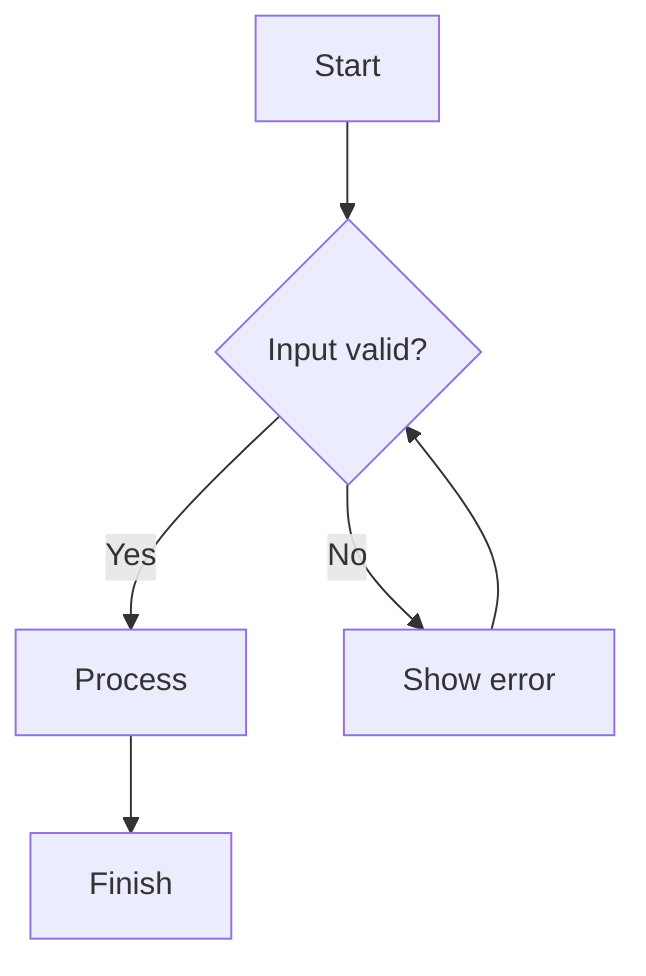
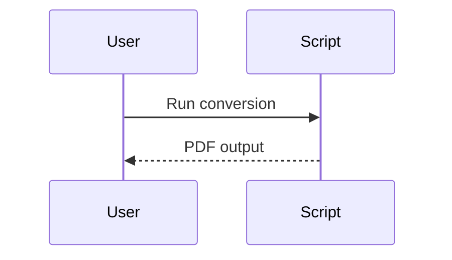

# Test Document for md-to-pdf

*Feature coverage sample for PDF conversion*

This file validates the main behaviors of `md-to-pdf.py`.
It intentionally mixes content types to test parsing, styling, and rendering.

## Table of Contents

- This section should be removed from body content by the converter.
- The generated TOC should come from `##` and `###` headings below.

## Metadata and Anchors

This section tests heading extraction and anchor slug generation.

### Heading With **Bold**, *Italic*, and `Code`

A heading like this should still generate a clean slug without markdown markup.

### Heading With [Link Label](https://example.com)

The visible link text should be used when the slug is generated.

## Callouts

> [!note] Basic note
> Callout content supports **bold**, `inline code`, and links.
> This line should remain a new line in the same block.

> [!warning] Risk reminder
> Use this type for critical warnings.

> [!caution]
> Alias types should map to canonical CSS classes.

> [!todo] Checklist
> - Item one
> - Item two

> [!faq] Custom title still optional
> If a title is omitted, a default should be used.

## Lists and Tables

A paragraph directly before a list should still render the list correctly.
- Bullet one
- Bullet two

1. Ordered one
2. Ordered two

| Column A | Column B | Column C |
| --- | --- | --- |
| alpha | beta | gamma |
| 1 | 2 | 3 |

## Code Blocks

```python
def hello(name: str) -> str:
	return f"Hello, {name}!"

print(hello("world"))
```

```bash
echo "shell block"
printf "line-1\nline-2\n"
```

## Mermaid Diagrams





## Blockquotes and Linebreaks

> This is a plain blockquote line.
> This should stay on a separate visual line.
> And so should this one.

## Final Section

This file should generate a PDF with:
- Cover metadata (title/subtitle)
- Auto TOC from headings
- Styled callouts
- Rendered Mermaid diagrams
- Working tables, lists, and code blocks
